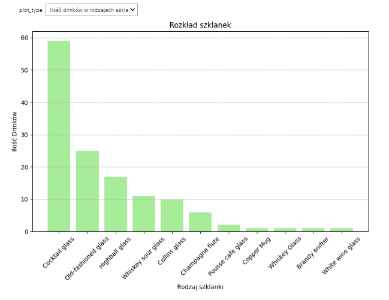
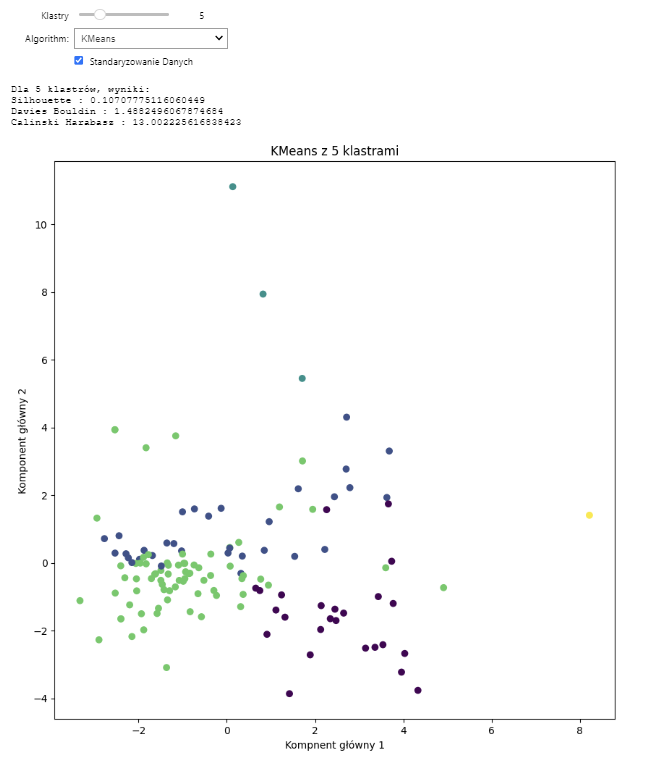
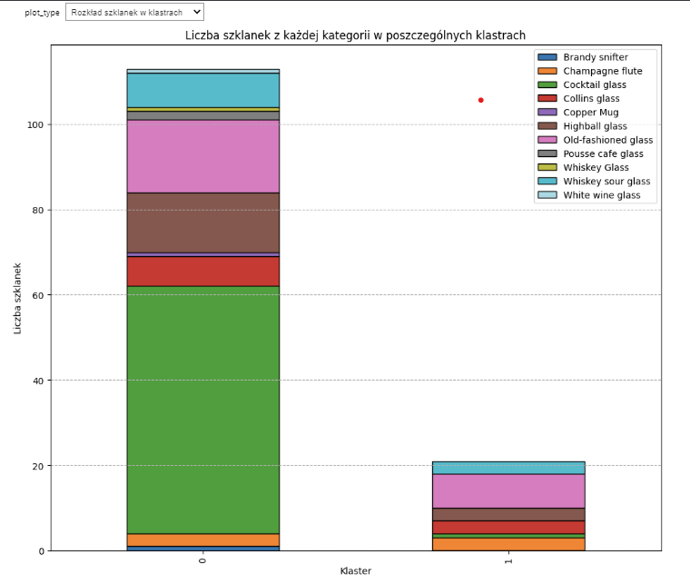

# Klasteryzacja koktajli z bazy TheCocktailDB

Projekt został wykonany w ramach zadania rekrutacyjnego do koła naukowego Solvro. Zadanie polegało na analizie i czysczeniu danych oraz klasteryzacji zbioru koktajli. Oryginalne dane znajdują się w pliku `cockatil_dataset.json`

## Uwaga
Do przedstawienia wyników w notaniku jupyter uzyte zostały interaktywne wykresy, które nie są widoczne w ramach 'Preview' na githubie. Aby zobaczyć je w całości należy uruchomić program na własnej maszynie. Przykłady wykresów niewidocznych na githubie:





## Pliki
`cockatil_dataset.json` - zbiór danych do zadania

`data_cleaning.py` - skrypt do czyszczenia naszego zbioru

`find_optimal_clusters.py` - skrypt do znajdowania optymalnej ilości klastrów

`results.ipynb` - notatnik jupyter w którym przedstawione są wszystkie wyniki. Jest to też jedyny plik którego uruchomienie jest wymagane aby ujrzeć wizualizacje wyników.

## Środowisko
Aby odtworzyć wyniki potrzebny jest zainstalowany python (w moim przypadku była to wersja 3.10.7) oraz zainstalowanie bibliotek z pliku `dependencies.txt`.
Można to zautomatyzować klonując to repozytorium i wpisując 
```bash
pip install -r /sciezka/do/pliku/dependencies.txt
```
## Wyniki i Wnioski
Przeglądając plik results.ipynb można zobaczyć, że wyniki nie są zachwycające. Wyniki Silhoutte wachaja się w okolicach 0.20 co bynajmniej nie jest zachwycającym wynikiem, jednak przy odpowiednim dostrojeniu ilości klastrów wartości te znacząco wzrastały. Największym wyzwaniem jednak było wyczyszczenie danych oraz zapoznanie się z ich strukturą. Plik data_cleaning jest wynikiem wielogodzinnej eksploracyjnej analizy danych i został sproszczony do jak najkrótszej i najbardziej przejrzystej formy. 
